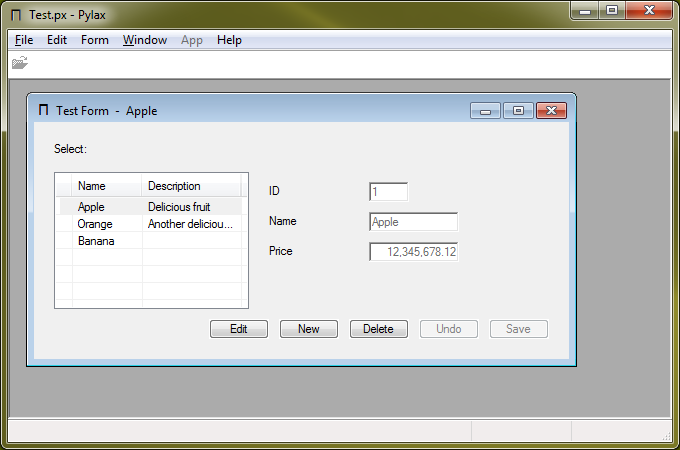

# Pylax
Database front end using embedded Python as scripting language

Started out on [Win32](Win)

but switched to [GTK](GTK) because development went much faster.

Database back ends supported are SQLite, PostgreSQL, MySQL and
[Hinterland](Hinterland).
